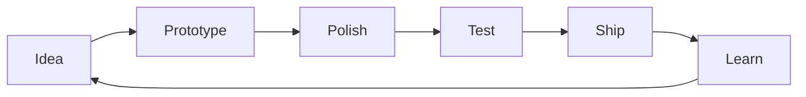

<div align="center">


<p>
  <a href="https://github.com/TypeThe0ry?tab=followers"></a>
  <a href="https://github.com/TypeThe0ry?tab=repositories"></a>
  
</p>

<p>
  
</p>

</div>

---

## ✨ About Me

```ts
const TypeThe0ry = {
  role: "Developer / Builder / Lifelong learner",
  focus: ["Full-stack craft", "Automation", "AI tooling", "Developer experience"],
  values: ["Clean architecture", "Delightful UI", "Fast feedback", "Useful products"],
  status: "Designing, coding, iterating — one commit at a time",
};
```

<table>
<tr>
<td width="55%">

### 🚀 Current Status

- 🧠 Learning by building and documenting along the way
- 🛠️ Polishing projects with better UI, motion, and reliability
- 🤝 Open to interesting ideas, collaboration, and feedback
- 🌱 Keeping the stack modern, practical, and enjoyable

</td>
<td width="45%">


</td>
</tr>
</table>

---

## 🧰 Tech Toolbox

<div align="center">


</div>

---

## 📊 Live Metrics

<div align="center">


<br />
<br />


<br />
<br />


<br />
<br />


</div>

---

## 🎯 What I Care About

<table>
<tr>
<td align="center" width="25%">
  <h3>🎨 Beauty</h3>
  <p>Interfaces should feel calm, intentional, and enjoyable.</p>
</td>
<td align="center" width="25%">
  <h3>⚡ Speed</h3>
  <p>Fast feedback loops make better products and happier builders.</p>
</td>
<td align="center" width="25%">
  <h3>🧩 Clarity</h3>
  <p>Readable systems beat clever systems when projects grow.</p>
</td>
<td align="center" width="25%">
  <h3>🛰️ Status</h3>
  <p>Dynamic signals make progress visible and motivating.</p>
</td>
</tr>
</table>

---

## 🗺️ Workflow



---

<div align="center">

### 🌌 Thanks for visiting


</div>
