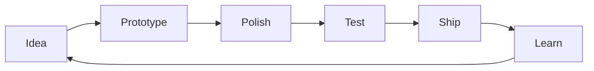

<div align="center">
  
  <p>
    <a href="https://github.com/TypeThe0ry?tab=followers"></a>
    <a href="https://github.com/TypeThe0ry?tab=repositories"></a>
    
  </p>
  
</div>

## ✨ About Me

```ts
const TypeThe0ry = {
  role: "Developer / Builder / Lifelong learner",
  focus: ["Full-stack craft", "Automation", "AI tooling", "Developer experience"],
  values: ["Clean architecture", "Delightful UI", "Fast feedback", "Useful products"],
  status: "Designing, coding, iterating - one commit at a time",
};
```

> I like turning practical ideas into polished products: clear structure, smooth interaction, fast iteration, and visible progress.

## 🚀 Current Status

- 🧠 Learning by building and documenting along the way
- 🛠️ Polishing projects with better UI, motion, and reliability
- 🤝 Open to interesting ideas, collaboration, and feedback
- 🌱 Keeping the stack modern, practical, and enjoyable

## 🧰 Tech Toolbox

<div align="center">
  
</div>

## 📊 Live Metrics

<div align="center">
  
</div>

## 🎯 Principles

<table>
  <tr>
    <td width="50%"><b>🎨 Beauty</b><br />Interfaces should feel calm, intentional, and enjoyable.</td>
    <td width="50%"><b>⚡ Speed</b><br />Fast feedback loops make better products and happier builders.</td>
  </tr>
  <tr>
    <td width="50%"><b>🧩 Clarity</b><br />Readable systems beat clever systems when projects grow.</td>
    <td width="50%"><b>🛰️ Status</b><br />Dynamic signals make progress visible and motivating.</td>
  </tr>
</table>

## 🗺️ Workflow



<div align="center">
  
</div>
